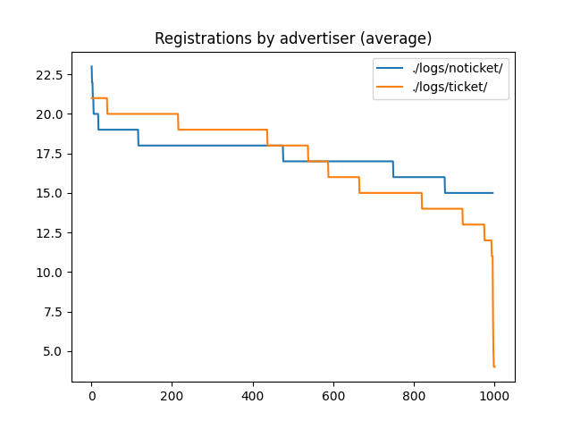
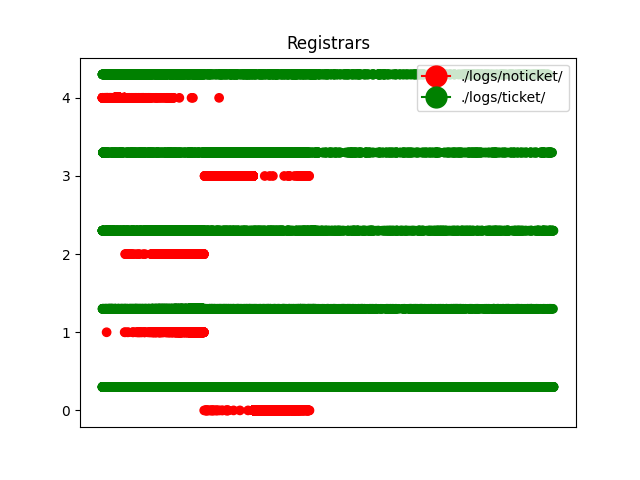

# Report without attacks

## Setup
The report consist of a comparison between simulations using the following configuration files:
* `./config/discv5ticket.cfg` - `./logs/ticket` on the graphs
* `./config/discv5noticket.cfg` - `./logs/noticket` on the graphs

The parameters used in the simulation are the following:
* 1000 nodes
* No turbulence/churn.
* Bucket size: 17 (for routing, ticket and search table).
* Topic table: 100 per topic limit and 500 total limit.
* Ticket expiration time: 15min.

  
   

<!--  |  -->

The graph above shows the number of messages received by nodes in the network. 
The ticket protocol sends advertisement and lookups to a higher number of nodes and expieriences high number of received messages. We're currently investigating why there's a significant disproportion in the number of received message between nodes. 

In contrast, the noticket protocol sends advertisement and lookups to a small portion of the nodes (close to the topic hash) and produces lower overhead.

The same applies for the sent messages 

We continue by analyzing the number of registrations present on regisrars. 

The noticket proposal results in less equal load on registrars. Nodes closer to hashes of popular topic receive more traffic than the rest. 
This effect is mitigated in the ticket protocol as the registration are performed at uniformly distributed nodes. However, the ticket protocol place the advertisements on a higher number of registrars. 

We now have a look at the number of successful registrations for each topic. 

The number of registrations follows the popularity of each topic (more popular topic having more registrations in the network). We don't observe major differences between the protocols. 

We analyze the number of advertisements placed by each registrants:

For the noticket protocol the number of placed ads differs slightly. It depends on the distance of the registrant's id from the topic id. The furher away the registrant is, the more nodes it needs to traverse thus placing more advertisements. 

For the ticket protocol, we also observe differences in the number of placed ads. This is a consequence of the initial connections present in the DHT. Nodes having some buckets empty need first to fill them up by sending FIND messages. it delays the registration process and results in a lwoer number of places registrations. 

Finally, we observer the registrants for each topic. The x-axis represents the ID hash space. 

Both protocol expierience similar number of registrants uniformly distributed for each topic. This is expected, as it's a part of the random registrant selection process. 

The situation changes when observing the registrars for each topic:

The ticket protocol places advertisements on registrars uniformly distributed over the hash space. We do not observe differences between various topics. In contrast, the noticket protocol places advertisements uniquely close to the hash of each topic. 
