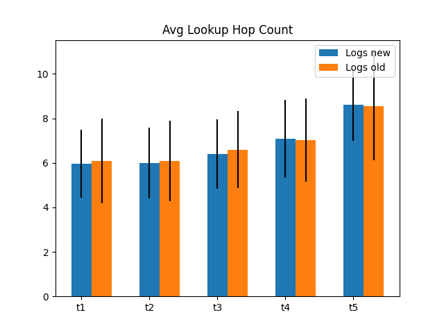
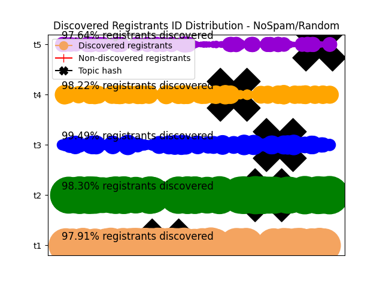
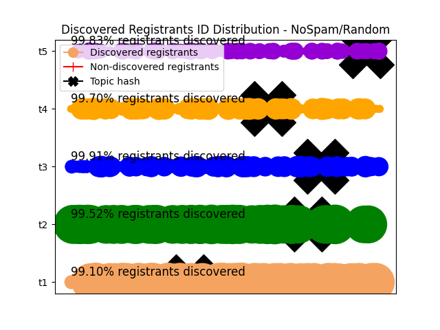
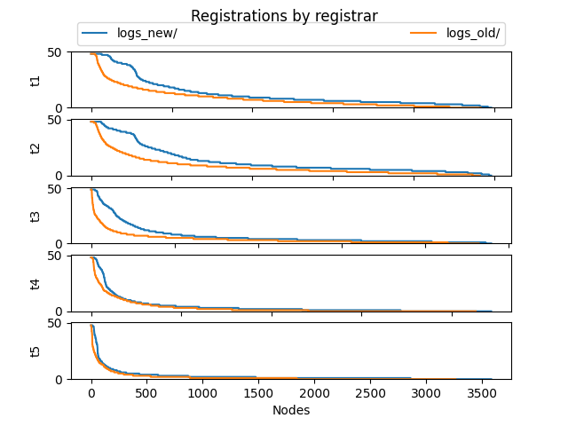

# Milestone 1 (Traffic optimization and load balancing) report

## Setup
The report consist of a comparison between the specs developed in the first discv5 service discovery project
and the [new specs](https://github.com/datahop/p2p-service-discovery/blob/d67a7ccd2b4c2c6bec38f5987c99cb13ea074cdc/doc/specs.md) aimed at improving traffic optimization and load balancing

The parameters used in the simulation are the following:
* Network size: 5000 nodes.
* Simulation time: 1 hour.
* Ticket table capacity: 100.
* Number of topics: 2 to 5 (zipf distribution 0.7).
* Topic queue capacity: 50.
* Ticket table bucket size: 3
* Search table bucket size: 16
* Search strategy: Closest distance
* Results limit lookup: 50.
* Turbulence events: each 1.5 sec.
* Registration lifetime (i.e., expire after): 5 minutes

This simulation is aimed at testing the behaviour of the new registration process that sequentially "walks" through the buckets starting from the farthest bucket and proceed incrementally with buckets closer to the topic hash, instead of registering in parallel for each bucket to reduce the traffic load and improve the load balancing in the network. 
The topic table structure used is the same of the [initial specifications](https://github.com/harnen/p2p-service-discovery/blob/master/doc/design.md) and also the waiting time calculation, based on topic queue slots availability.

## Messages exchanged over simulation time

In these two figures we can observe the total number of messages exchanged (differentitated by message type) in the simulation over time using the new registration process (left figure) and the previous one (right figure).

  
  

<!--  |  -->

We can see most of the messages exchanges are registrations requests, and these are reduced 20x with the new specs.

## Messages received per node

In this figure we can observe the total number of messages received per node comparing the new registration process (blue) and the previous one (orange), and therefore the load balancing in the simulation. 

  

In the figure we observe the message distribution skeweness is reduced to the minimum. This was caused by the fact that nodes with Node ID close to the Topic Hash Id were receiving much more number of registrations because of the ticket table structure, were only a few number of nodes are in the buckets for shortest distances. With the new registration system, these nodes they do not receive an excessive number of messages because in most of the cases the registration process is stopped before arriving to these nodes.

## Lookups hop count 

In this figure we can observe the hop count required to discover the target nodes (50 nodes) comparing the new registration process (blue) and the previous one (orange).

  

Therefore, we can observe lookup performance is not affected by the fact of placing less registrations in the network with the new system.

## Discovered registrations distribution per topic

In these figures we can observe the distribution of advertising nodes discovered (and the discovery frequency shown in the size of the dots) comparing the new registration process (blue) and the previous one (orange). Discovery distribution is not clearly affected by the new registration mechanism.

  
  

## Ticket registrations placed per topic

In this figure we can observe the registrations distribution in the 'registrar' nodes, comparing the new registration process (blue) and the previous one (orange).

  

We observe that actually, the number of active registrations is superior using the improved registration mechanism.

