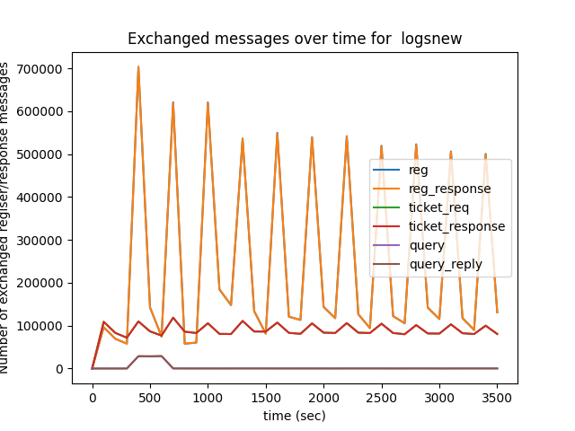
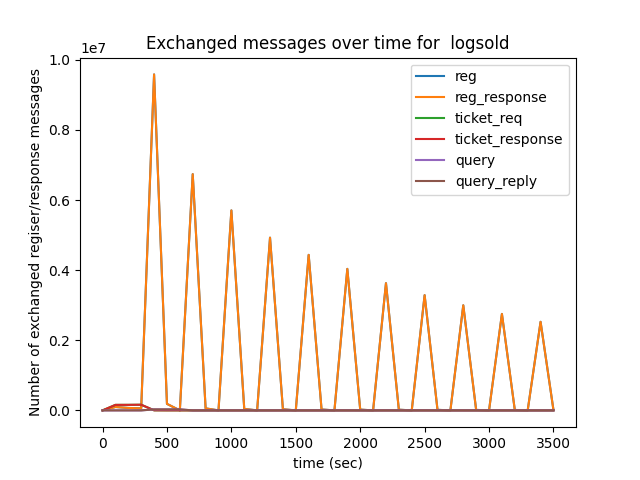
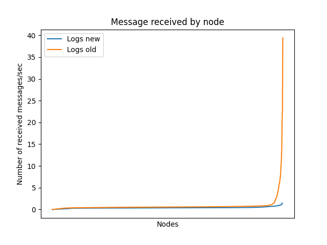

# Milestone 1 (Traffic optimization and load balancing) report

## Setup
The report consist of a comparison between the specs developed in the first discv5 service discovery project
and the [new specs](doc/specs.md) aimed at improving traffic optimization and load balancing

The parameters used in the simulation are the following:
* Network size: 5000 nodes.
* Simulation time: 1 hour.
* Ticket table capacity: 100.
* Number of topics: 2 to 5 (zipf distribution 0.7).
* Topic queue capacity: 50.
* Ticket table bucket size: 3
* Search table bucket size: 16
* Search strategy: Closest distance
* Results limit lookup: 50.
* Turbulence events: each 1.5 sec.
* Registration lifetime (i.e., expire after): 5 minutes

## Messages exchanged over simulation time

  
  

<!--  |  -->

## Messages received per node

  

