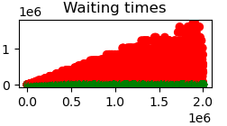

# Milestone 2 (Topic table structure) report

## Setup
The document presents a performance evaluation of the proposed topic table structure and waiting time computation discussed in the
the [new specs](https://github.com/datahop/p2p-service-discovery/blob/d67a7ccd2b4c2c6bec38f5987c99cb13ea074cdc/doc/specs.md). 

A waiting time is computed based on a function which evaluates an incoming registration based on its diversity from the existing registrations in the topic table. The diversity evaluation investigates three aspects of a registration: 
1. *Source IP address* of the registrant that issued the request.
2. *Node ID* of the registrant that issued the request.
3. The topic that the registrant desires to register. 

Corresponding to each of these three components are three **modifier functions**. Each modifier function returns a value which is higher (lower) when the diversity of the request (in comparison to the existing ads in the table) is worse (better). For example, an *IP modifier* computes a value based on the diversity of the source IP address of the registrant compared to the source IP addresses of the registrants that currently have an ad in the table. The final waiting time is computed as the multiplication of the three modifiers (see the spec for details). 

In the performance results we evaluate a single topic table using a python-based [simulator] (https://github.com/datahop/p2p-service-discovery/tree/add_ips/service-discovery/python). 

We use two types of workloads consisting of registrations from both malicious and honest nodes: 
1. **Random topic ID (Spam):** In this workload, registrations from attackers use a pool of *three IP addresses* and *ten node IDs*. The attackers attempt to register random topic IDs which are not used by honest nodes.
2. **Target topic ID (Topic Attack):** In this workload, registrations from attackers again use a pool of *three IP addresses* and *ten node IDs*. However, this time they also target a specific topic IDs that are used by honest nodes. We evaluate the cases of targeting most popular topic and least popular topic. 

In both workloads, the rate of attacker registrations is ten times the rate of registrations from honest nodes. Once their registrations are successful, both the attackers and honest nodes send a new registration (i.e., ticket) request once their ads expire. 

* Simulation time: 2000 seconds.
* Zipf distribution exponent of 2.0 for the topic distribution with 100 topics.
* No topic queue limit.
* Registration lifetime (i.e., expire after): 30 seconds.

## Random topic ID traffic results

In the first experiment, we use the spam workload where attackers use random topic IDs. We initially use a very small **topic table capacity of 25**. This is an extreme case with topic table having very little capacity.

  
  
  

In these graphs (and in the ones below) the **green lines** are for the honest registrations and **red  lines** are for the malicious registrations. In the leftmost plot, we present the occupancy of the topic table by the ads from both malicious (red line) and honest (green line) registrants. We observe that honest registrations dominate the storage space of the topic table. 

In the middle plot, we observe the acceptance rate of ticket requests from malicious and hones registrants. Aligned with the occupancy results, this plot shows that the ratio of registrations accepted from honest registrants is higher than the ratio of registrations accepted from malicious nodes. The rightmost plot demonstrates the waiting time returned to malicious and honest registrants over time. Here, we also observe that the ticket requests from malicious registrants obtain a much higher waiting time than the ticket requests from honest nodes due to diversity modifiers. 

The graphs below demonstrate the values computed by the three modifier functions. The top graph shows the IP modifier, the middle graph shows the node ID modifier, and the bottom graph shows the topic ID modifier values. For this workload, the registrations from the attackers exhibit a low diversity in IP address and node ID aspects, while their topic diversity is high. The values returned by each modifier are essentially waiting time penalties - the higher the value the higher the waiting time returned by the registrar is. By design the range of values returned by the topic ID modifier is much lower (i.e., lower penalty) compared to node ID and IP address modifiers. However, because the waiting time is the multiplication of these three modifiers, the waiting time returned to malicious registrants are still much higher than the waiting time returned to honest registrants. 

  

We also plot the same results with a **large topic table capacity of 1000**. In this case, we observe that the topic table successfully limits the registrations from malicious nodes even though all the ads occupy at most 40% of the table over time. As shown in the leftmost plot, the ads from the honest registrant occupy majority of the table space throughout the experiment, while the ad space used by malicious nodes are successfully kept constant at around 3% of the full table. These results demonstrate the effectiveness of the waiting time approach with a spamming traffic. 

  
  
  

## Target topic ID 

For the experiments below, we use the target topic ID workload where malicious nodes attack a particular topic ID used by honest nodes, instead of generating random topic IDs that are not used by the honest nodes (as we did in the previous experiments). In the first experiment, the malicious nodes attack the most popular topic ID used by the honest nodes. The results of this first experiment is shown below. We observe that our approach is also successful against attacks to popular topics as the the occupancy of the topic table is dominated by ads from honest nodes throughout the duration of the experiment. 

In these results, we see a slight oscillation in the occupancy of table by honest and malicious nodes over time. The oscillation is due to requests from attackers arriving at the registrar in bursts and a small portion of them are admitted to the table at the same time. However, the burst is kept small throughout the experiment. 

  
  
  

We also experimented with a slightly modified waiting time function where a max() is applied to the modifiers to obtain the final waiting time as max(IP modifier, Node ID modifier, topic ID modifier) instead of a multiplication. With this function, we observe a much worse oscillation than the waiting time computed with the multiplication (the results are not shown) because a larger portion of registrations that arrive in bursts also obtain more similar waiting times and eventually register their ads successfully in the table. 

In the seconds set of experiments, the malicious nodes attack the least popular topic ID used by the honest nodes. Even in this case, we observe that the topic table successfully limits the registrations by malicious nodes. 

  
  
  

