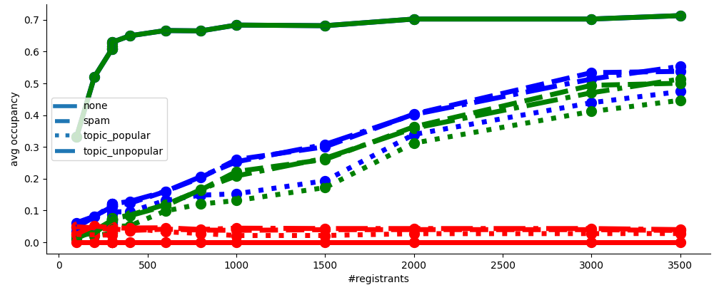
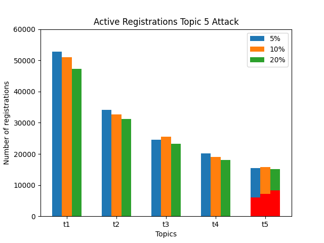
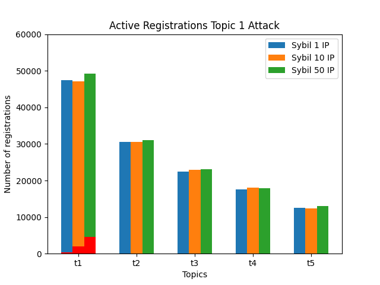
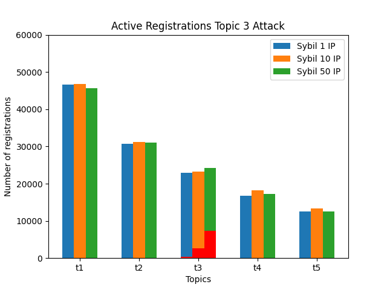
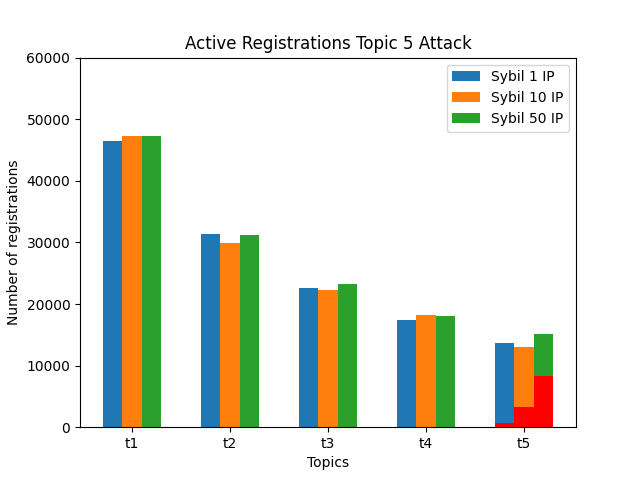
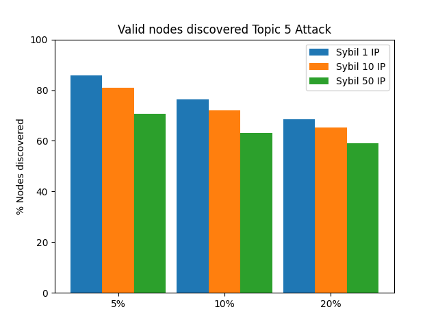
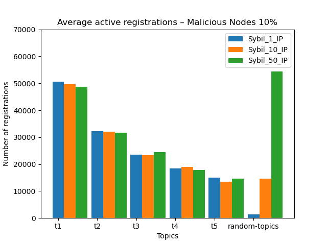

# Milestone 3 (Security analysis) report

## Intro
The document presents a security analysis of the proposed discovery protocol for the Ethereum  P2P network (discv5) following the described [specs](https://github.com/datahop/p2p-service-discovery/blob/d67a7ccd2b4c2c6bec38f5987c99cb13ea074cdc/doc/specs.md). 

## Assumptions

Assumptions followed during the security analysis:

* A1 - the network consists of a large amount of nodes (1k-10k)
* A2 - each honest node has a unique node ID and an IP address. The same IP address may be shared by a small number of honest nodes (e.g., due to NAT). 
* A3 - each node can register to multiple topics. 
* A4 - the popularity of the topics may vary significantly and follows a zipf distribution
* A5 - no single node can be trusted.
* A6 - malicious nodes may be present in the network. The attackers may send any type and amount of messages to any other node, limited only by their the attacker resources (bandwidth, CPU).
* A7 - a single malicious participant can produce a large amount of fake (Sybil) identities. The attacker will be limited in the number of the IP addresses and IDs they control. We expect an attacker being able to generate much more different IDs than IPs.

## Design Goals
Under the assumptions above we aim to achieve the following properties:

* G1 - all the registrants (regardless of the topic they register for) should be able to place their advertisements in the network. Aka no registrants can be globally denied registrations.
* G2 - all the registrants within each topic should have a similar probability of being discovered by their peers.
* G3 - the load (in terms of sent and received messages) should be equally distributed across all the nodes regardless of their ID and location in the network
* G4 - the registration operation should be efficient in terms of time (fast) for all the registrants
* G5 - the registration operation should be efficient in terms of overhead (low amount of sent/received messages) for all the registrants
* G6 - the lookup operation should be efficient in terms of time (fast) and messages sent (hop count) for all the query nodes
* G7 - the number of total registrations per topic should be proportional to the popularity of the topic (the number of registrants).
* G8 - the protocol should be resistant to network dynamic (nodes joining leaving)
* G9 - the protocol should be resistant to sybil attacks launched by malicious nodes as described in the section below.

For the security analysis we performed two different evaluations: 

 * A network simulation evaluation (using Peersim simulator) to evaluate the performance and check the security goals of the whole protocol. 
 * A second evaluation using a Python simulator to analyse the performance of the registration tables under different attacks and loads.

## Table Occupancy analysis (Python)
In this section, we analyze resiliance of a single registrar against 3 types of attacks:
* **spam attack** - the attacker tries to fill the topic table with registrations for random topics. Each registration sent back the attacker is for different topic. 
* **topic popular** - the attacker tries to fill the topic table with registrations for the most popular topic. Each registration sent back the attacker is for the same topic. 
* **topic unpopular** - the attacker tries to fill the topic table with registrations for the least popular topic. Each registration sent back the attacker is for the same topic. 
We comapre the results against a scenario with no attacks present. 

### Setup
We use the following default parameters. Note that the waiting times are calculated based on the occupancy/capacity ratio of the table. Thus the result are the same regardless of the actuall size of the table. 
* **ad_lifetime(3000)** - time in ms that a registration spend in the table
* **capacity(200)** - capacity of the table
* **size(300)** - the number of all the registrants (malicious + honest)
* **malicious rate(5)** - ratio malicious/honest registrants. For the default values, there are 50 honest registrants and 250 malicious ones.
* **malicious ips(3)** - the number of IPs shared across the malicious registrants
* **malicious ids(10)** - the number of IDs shared across the malicious registrants

### Results 

  
  
  
  
  

## Network Simulation analysis (Peersim)

### Setup

* Network size: 2000 nodes
* Simulation time: 4h
* Kademlia Bucket size: 16
* Kademlia buckets: 16
* Ticket table bucket size: 3
* Ticket table buckets: 10
* Search table bucket size: 16
* Search table buckets: 10
* Registration lifetime: 5 minutes
* Topics: 5
* Zipf exp: 0.7
* Lookup bucket strategy - all_bucket
* IP used in the attack [1,10,50]
* Malicious node % [5,10,20]

* Nodes for Topic: t1: 2000, t2 1272, t3: 803, t4: 496, t5: 218

### Attacks evaluated

* Hybrid attack: It combines spamming attack to existing topic attacks, where evil 'registrants' try to place as much as registrations as possible by using bigger ticket size , with malicious registrars attack, where evil registrars replies with only malicious nodes when receiving a topic query.
* Random topic spam attack: This attack tries to attack registrar topic table by spamming registrations of non-existing topics. 
* Dos registrar attack: Attack where malicious nodes try to backlog registrations from registrants by returning very long waiting times and reduce total number of registrations and therefore the performance of the system.

### Hybrid Attack

#### Active registrations (malicious in red)

* 50 Sybil IP, different % malicious nodes

  
  
  

* 20% Malicious, different Sybil size

  
  
  

#### Eclipsed nodes

  
  
  

#### Lookup performance

  
  
  

#### Discovered nodes distribution

  
  
  

### Random Topic Spam Attack 

* Active Registrations for 5, 10 and 20 percent malicious nodes

  
  
  

* Average time to register for 5, 10 and 20 percent malicious nodes

  
  
  

* Average lookup hop count for 5, 10 and 20 percent malicious nodes

  
  
  

* Discovered nodes distribution for 5, 10 and 20 percent malicious nodes

  
  
  

### DoS Registrar Attack

* Active registrations

  

## Conclusions

* Sybil malicious registrations are kept under control when using a limited number of resources (IP addresses)
* Protocol performance is mantained under topic spam and DoS attacks. 
* Nodes can be eclipsed for low popularity topics when using high number of sybil malicious nodes (>10% of the whole network). One solution could be to maximize the registrar origin of your connections list nodes by prioritising connections to the nodes that comes from different registrars.
