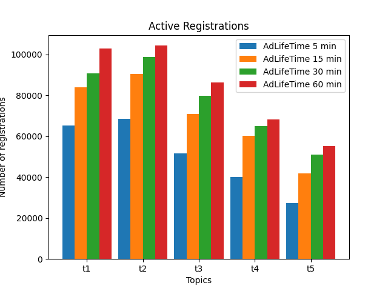
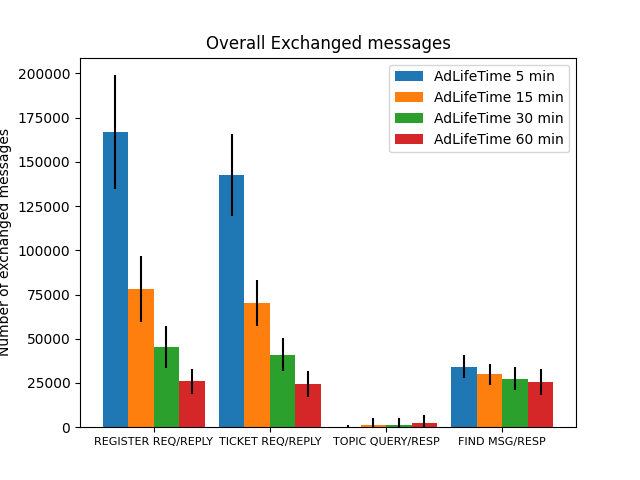
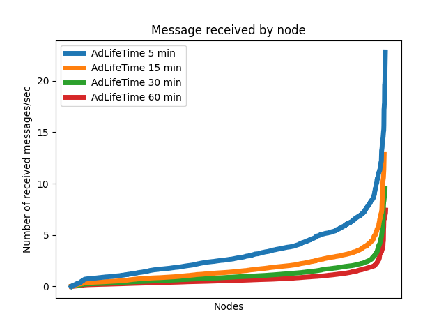
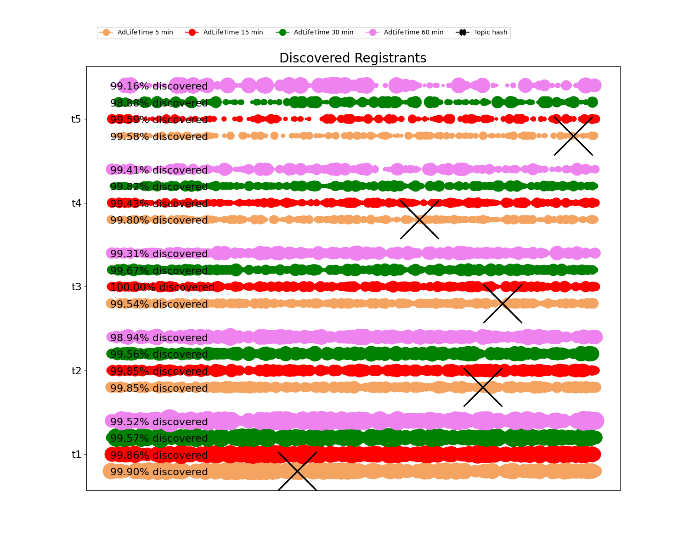
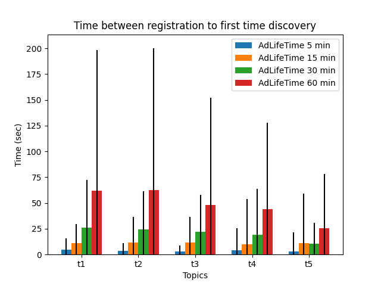
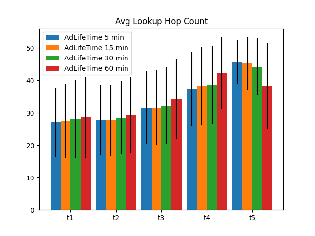
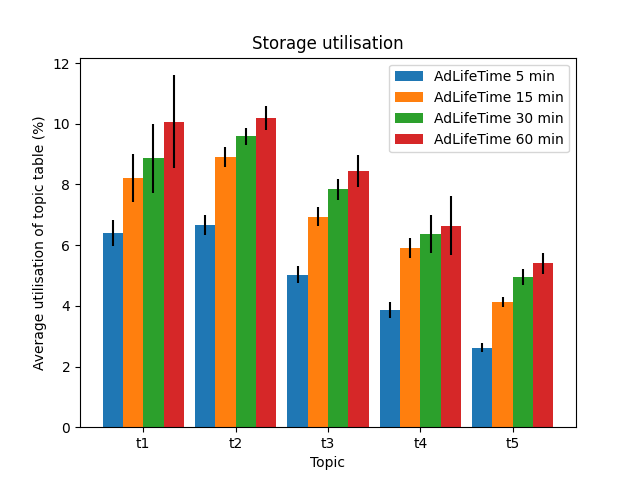

## Active registrations

  

## Traffic load

* Message quantity

  

* Message distribution

  

## Discovery

* Registrant discovery distribution

  

* Time between registration to first discovery

  

* Lookup hopcount

  

## Table occupancy

  

