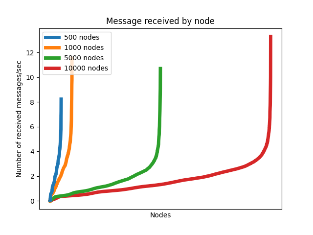
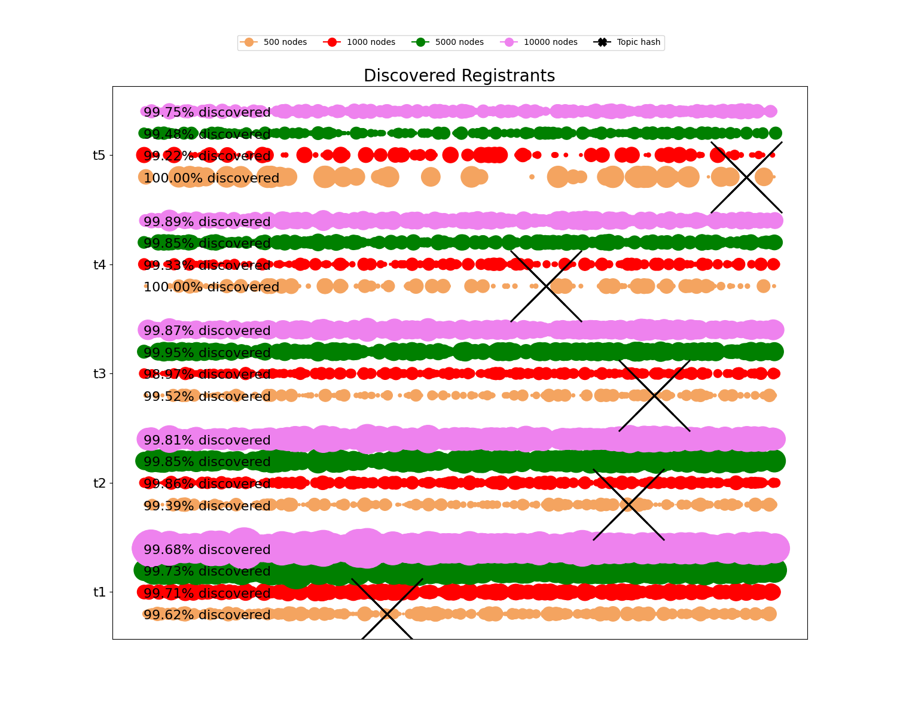

# Parameters evaluated

* Network size: 500 nodes, 1000 nodes, 5000 nodes, 10000 nodes.

# Results

## Active registrations

  

## Traffic load

* Message quantity

  

* Message distribution

  

## Discovery

* Registrant discovery distribution

  

* Time between registration to first discovery

  

* Lookup hopcount

  

## Table occupancy

  

# Conclusions

* It seems the system scales with no problem, with good traffic load values for network size of 10000 nodes.
