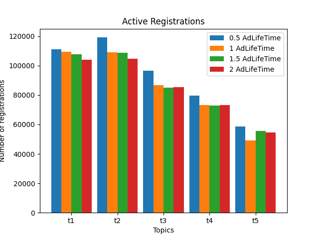
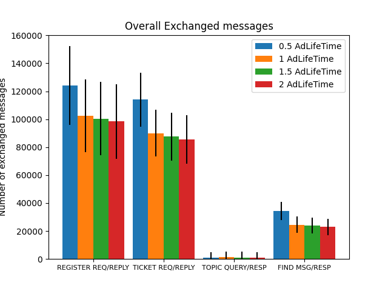
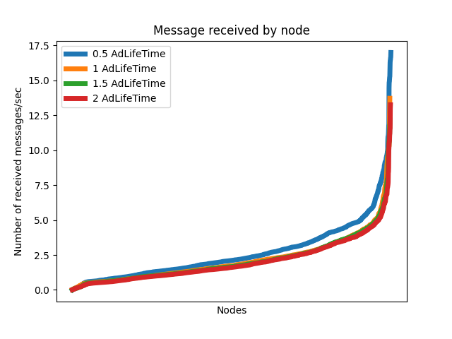
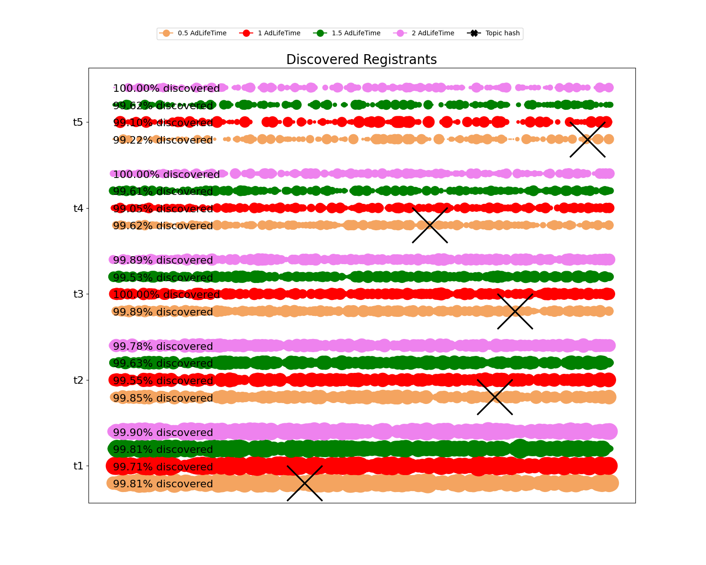
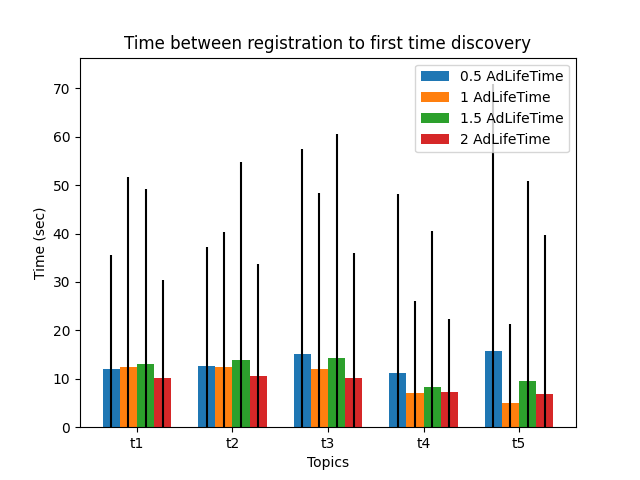
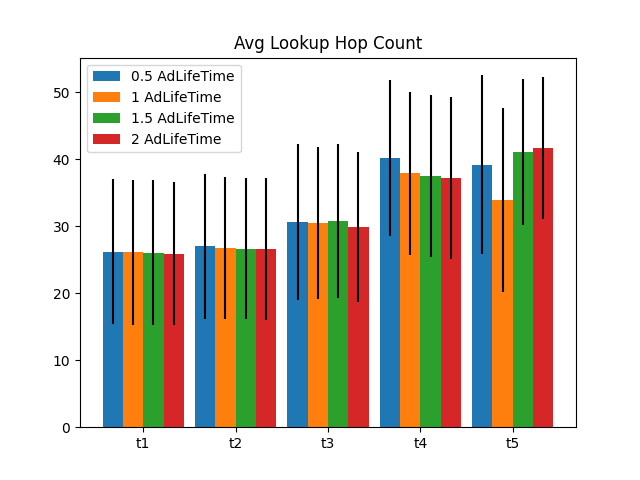
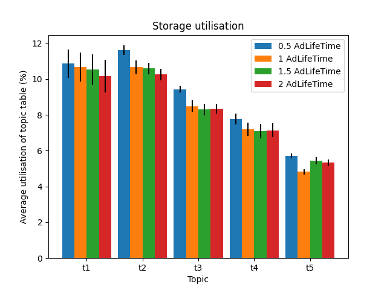

# Parameters evaluated

* Registrations lifetime: 0.5 * Ad lifetime, 1 * Ad lifetime, 1.5 * Ad lifetime, 2 * Ad lifetime.

* Value selected: 1 Ad lifetime.

# Results

## Active registrations

  

## Traffic load

* Message quantity

  

* Message distribution

  

## Discovery

* Registrant discovery distribution

  

* Time between registration to first discovery

  

* Lookup hopcount

  

## Table occupancy

  

# Conclusions

* We selected 1 registration lifetime as a timeout parameter for the registrations waiting time. Increase this value does not seem to increase the performance but can be a threat for dos attacks. 
