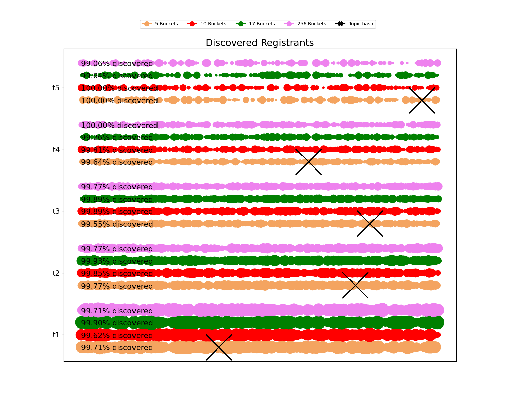
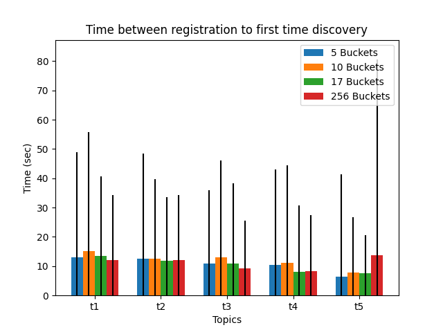
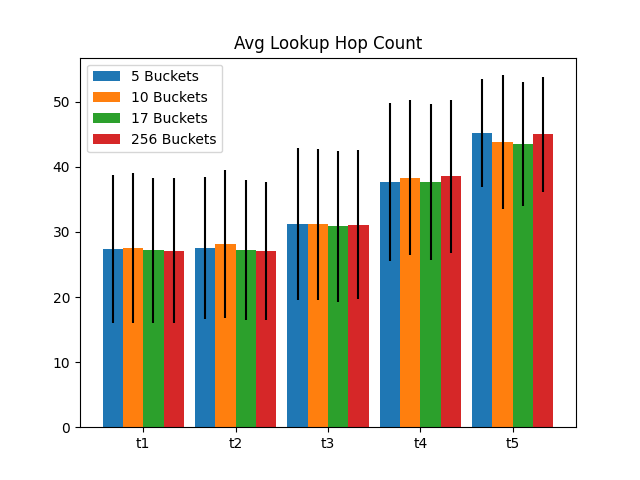

# Parameters evaluated

* Search table bucket size: 3, 5, 10, 16.
* Search table bucket number: 5,10,17,256.

* Value selected: 16 bucket size, 17 buckets.

# Results

## Discovery

* Registrant discovery distribution

  
  

* Time between registration to first discovery

  
  

* Lookup hopcount

  
  

# Conclusions

* We selected the same values used in the Ethereum DHT, since we do not have issues with the traffic load by increasing bucket size of bucket number as we have with the ticket table, but increasing it is not going to improve the search performance.
