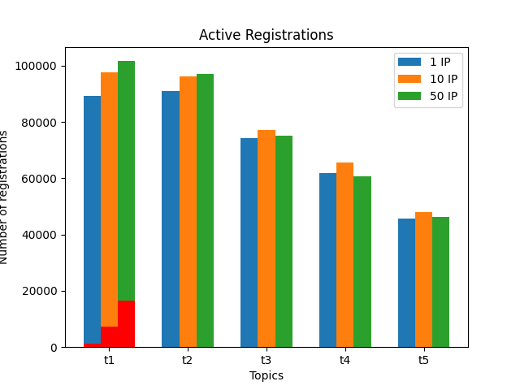
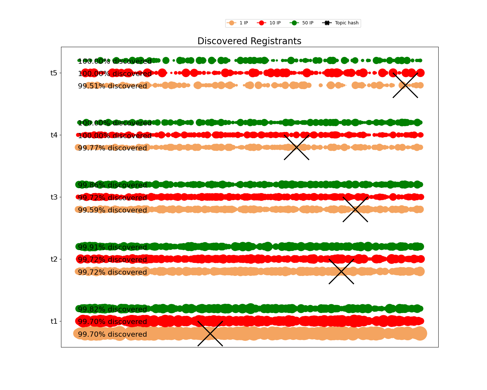
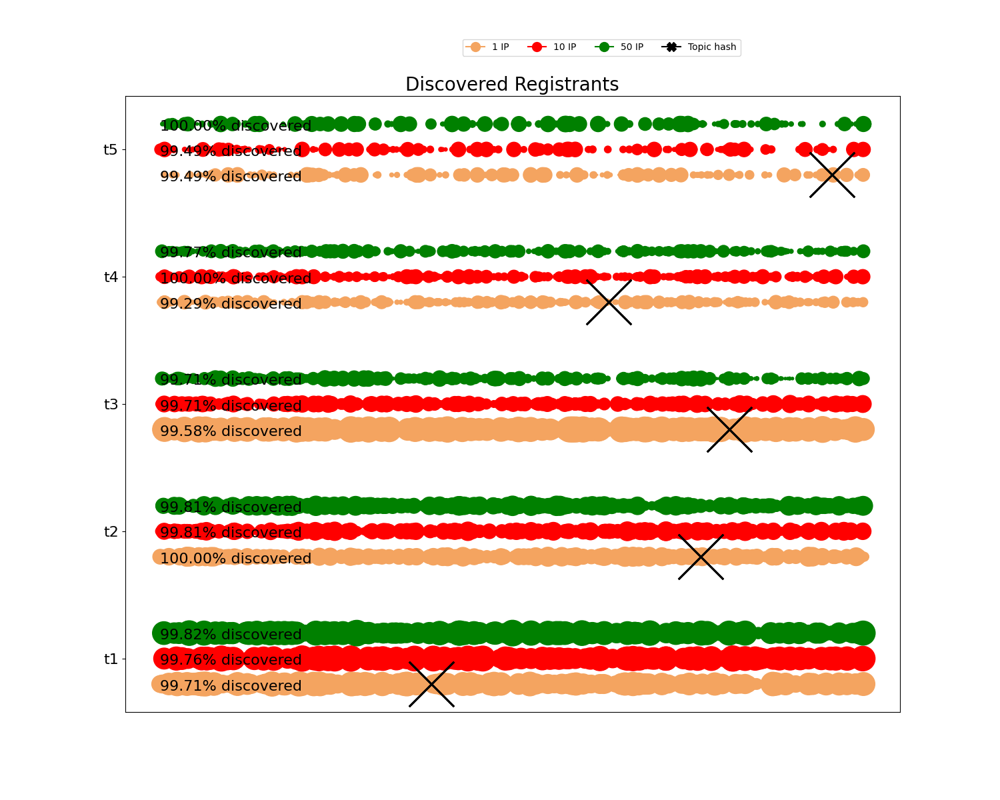
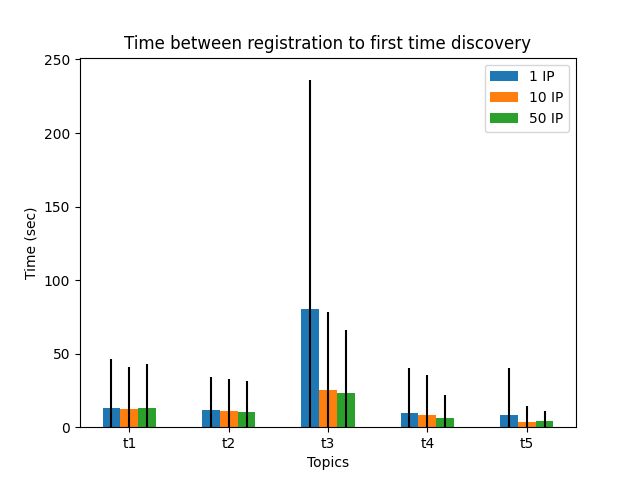
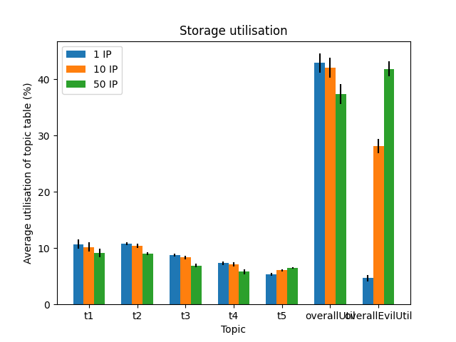
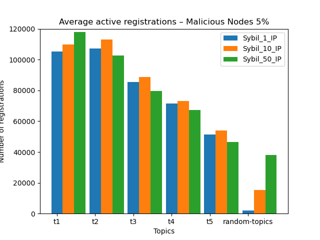

# Existing Topic Attack

## Active registrations
* 50 sybil IPs, modifying sybil %. Topic 1, Topic 3, Topic 5.

  
  
 

* 20 % sybils, modifying sybil IP Size. Topic 1, Topic 3, Topic 5.

  
  
 

## Discovery

* Registrant discovery distribution

  - 50 sybil IPs, modifying sybil %. Topic 1, Topic 3, Topic 5.

  
  
 

  - 20 % sybils, modifying sybil IP Size. Topic 1, Topic 3, Topic 5.

  
  
 

* Time between registration to first discovery

  - 50 sybil IPs, modifying sybil %. Topic 1, Topic 3, Topic 5.

  
  
 

  - 20 % sybils, modifying sybil IP Size. Topic 1, Topic 3, Topic 5.

  
  
 

* Lookup hopcount

  - 50 sybil IPs, modifying sybil %. Topic 1, Topic 3, Topic 5.

  
  
 

  - 20 % sybils, modifying sybil IP Size. Topic 1, Topic 3, Topic 5.

  
  
 

## Table occupancy

  - 50 sybil IPs, modifying sybil %. Topic 1, Topic 3, Topic 5.

  
  
 

  - 20 % sybils, modifying sybil IP Size. Topic 1, Topic 3, Topic 5.

  
  
 

## Eclipsed nodes

Topic 1, Topic 3, Topic 5

  
  
 

# Dos Attack

# Random Topic Attack

* Active Registrations for 5, 10 and 20 percent malicious nodes

  
  
  

* Average time to register for 5, 10 and 20 percent malicious nodes

  
  
  

* Average lookup hop count for 5, 10 and 20 percent malicious nodes

  
  
  

* Discovered nodes distribution for 5, 10 and 20 percent malicious nodes

  
  
  

# Conclusions

*
