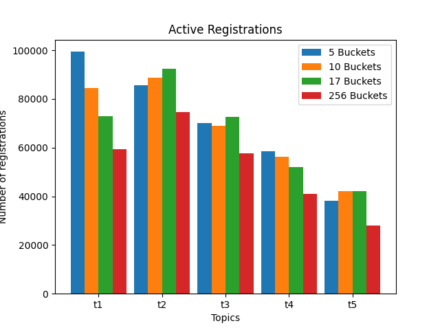
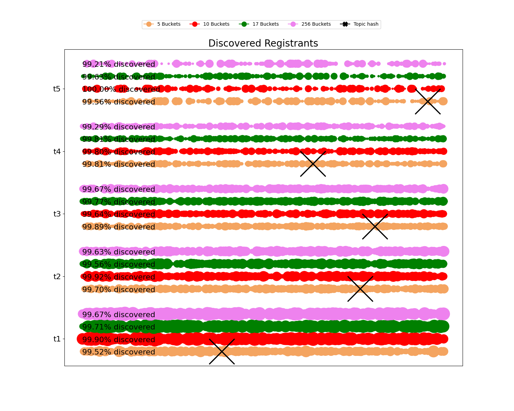
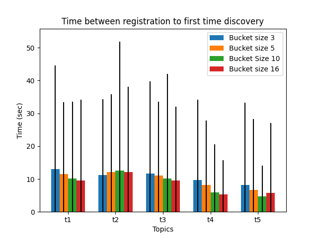

# Parameters evaluated

* Ticket table bucket size: 3, 5, 10, 16.
* Ticket table bucket number: 5,10,17,256.

* Value selected: 5 bucket size, 10 buckets.

# Results

## Active registrations

  
  

## Traffic load

* Message quantity

  
  

* Message distribution

  
  

## Discovery

* Registrant discovery distribution

  
  

* Time between registration to first discovery

  
  

* Lookup hopcount

  
  

## Table occupancy

  
  

# Conclusions

* We selected bucket size 5 and 10 buckets as configuration parameters.
* As we increase bucket size seems to increase the number of registrations but also traffic load in the same way. The lookup hopcount performance does not seem to improve in the same way, so we choose 5 as a bucket size to control the traffic load at nodes close to topic hash id. 
* For the bucket number 
