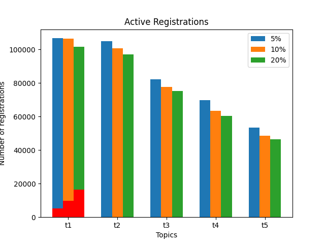
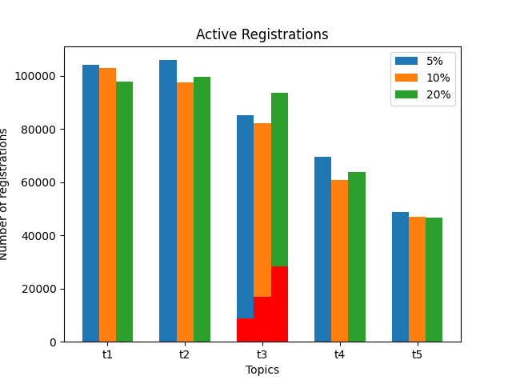
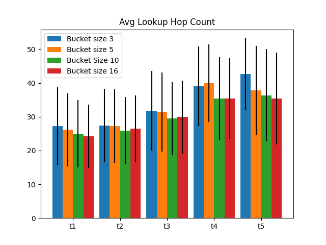

# Parameters evaluated

* Ticket table bucket size: 3, 5, 10, 16.
* Ticket table bucket number: 5,10,17,256.

* Value selected: 5 bucket size, 10 buckets.

# Results

## Active registrations
* 50 sybil IPs, modifying sybil %.

  
  
 

## Traffic load

* Message quantity

  
  

* Message distribution

  
  

## Discovery

* Registrant discovery distribution

  
  

* Time between registration to first discovery

  
  

* Lookup hopcount

  
  

## Table occupancy

  
  

# Conclusions

*
