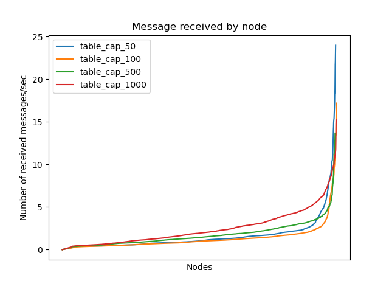

# Topic table capacity parameter

We observe the performance of the system for topic table capacities: 
* 50 
* 100 
* 500 
* 1000 

The rest of the parameters take their default values given in the [setup](../report.md#Setup-(default-parameters))

