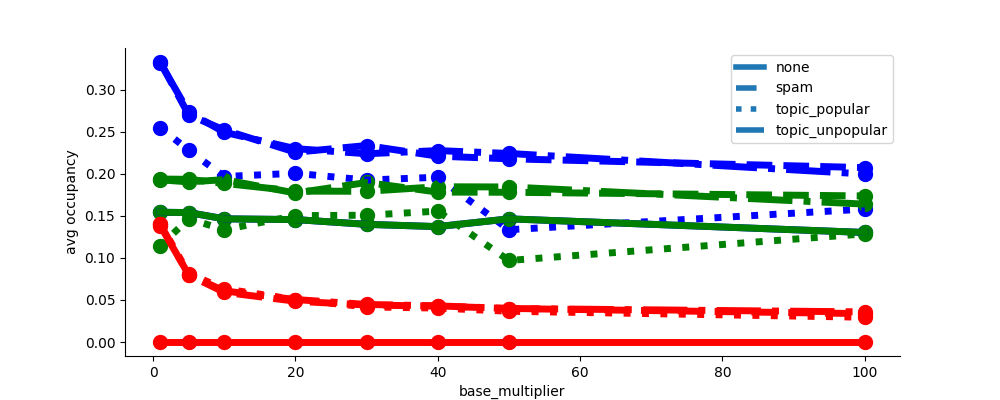
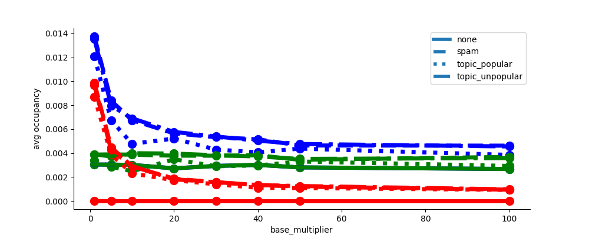
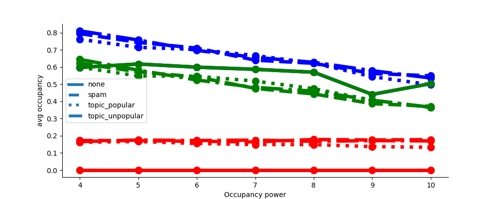
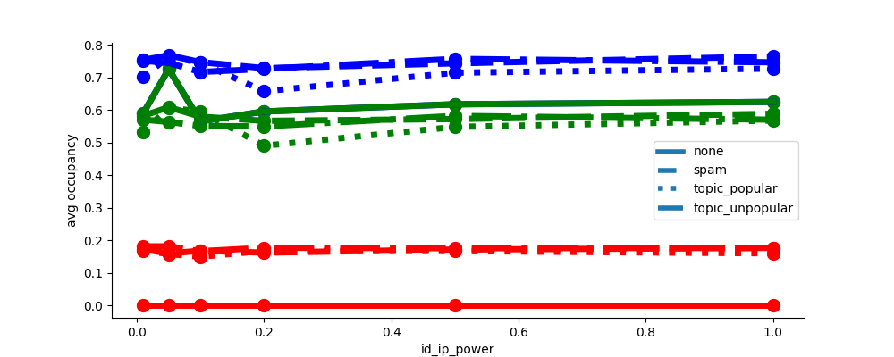
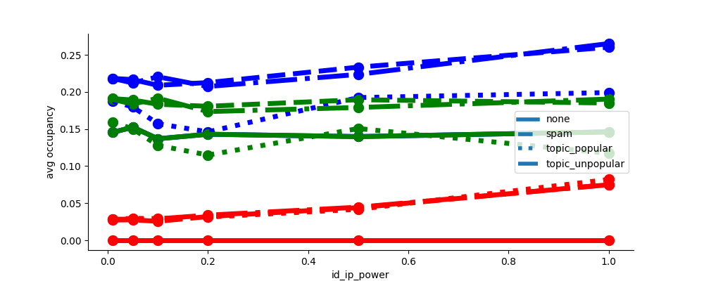
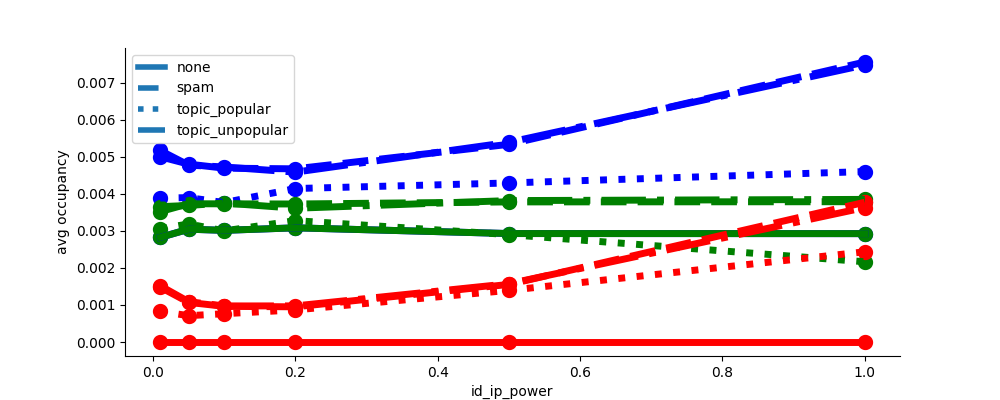
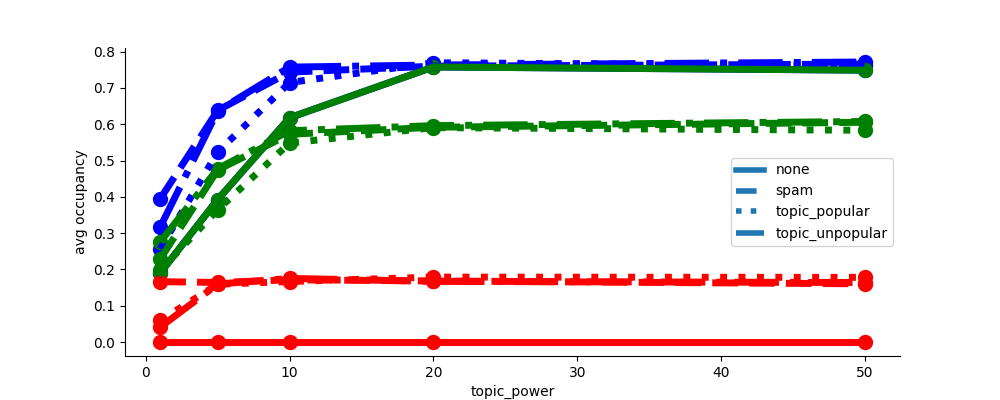
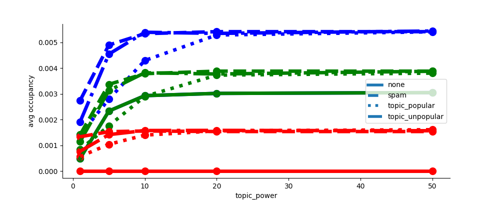

# Waiting time parameter selection

The waiting time formula:
* **n** - capacity of the table
* **d** - number of entries currently in the table
* **d(IP)** - number of entries currently in the table with given IP
* **d(ID)** - number of entries currently in the table with given ID
* **d(topic)** - number of entries currently in the table with given topic
* **a** - registration lifetime (time spent in the table)
* **w** - waiting time

We thus have 5 parameters to fix:
* **ip_power**
* **id_power**
* **topic_power**
* **occupancy_power**
* **base_multiplier**

We perform all the simulations with 50 honest nodes, 250 malicious honest having 10 IPs/IDs (10% of honest ones). We present results for three different table sizes: 50 (< #registrants), 400 (~= #registrants), 15000 (>> #registrants). 

## base_multiplier
We start by investigatnig base_multiplier. Lower values means lower waiting times. However, the the value must be high enough to efficiently prevent the malicious traffic from dominating the table. 

## occupancy_power

## id_ip_power

## topic_power

