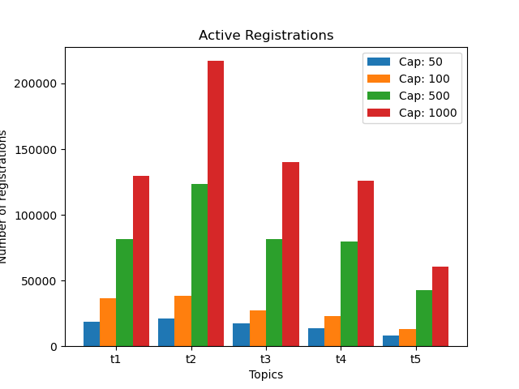
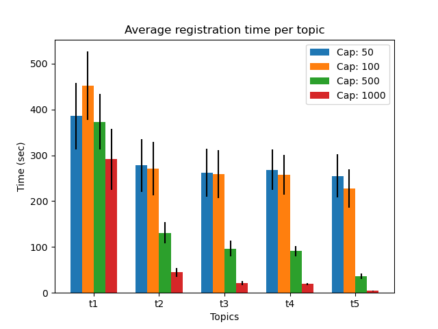
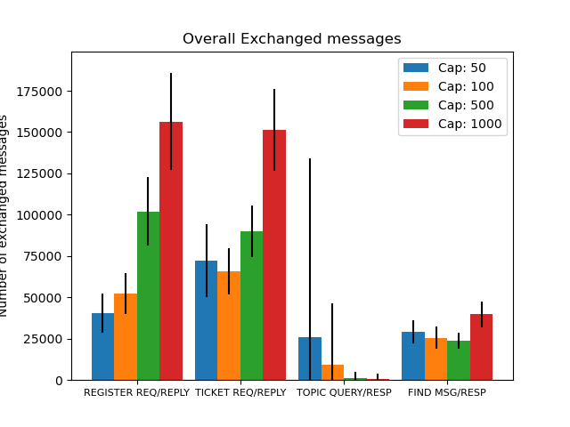
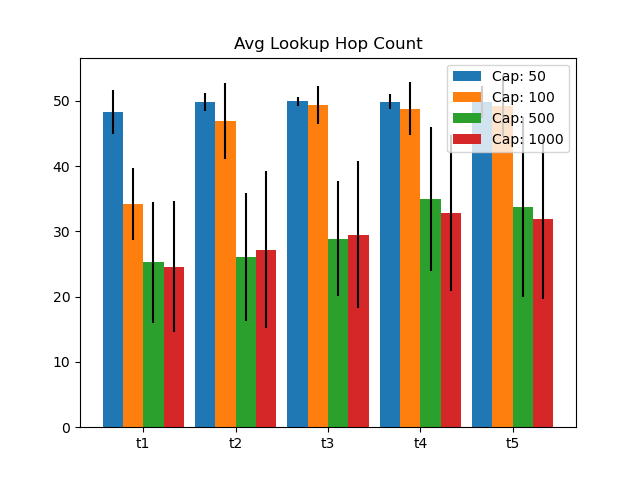

 # Parameters evaluated

* Topic table capacity 50, 100, 500, and 1000. The rest of the parameters take their default values given in the [setup](../report.md#Setup-(default-parameters))

* Value selected: table capacity = 500.

# Results

## Registration
* Active registrations

* Average time to register

## Load

* Message quantity

* Message distribution

## Discovery

* Registrant discovery distribution

* Time between registration to first discovery

* Lookup hopcount

## Table occupancy

# Conclusions

* We selected 500 registrations as a capacity of the topic table, since it appears to have the best balance between number of registrations and traffic generated.

