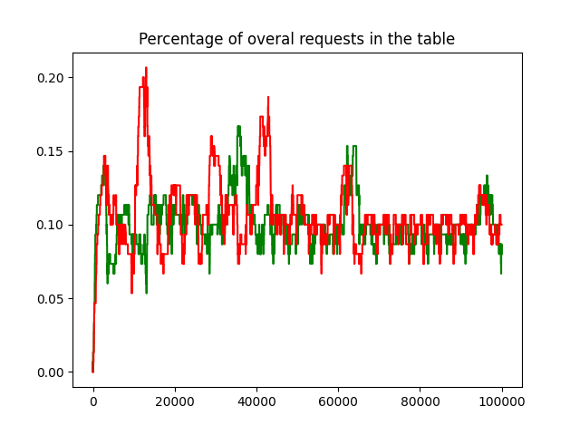
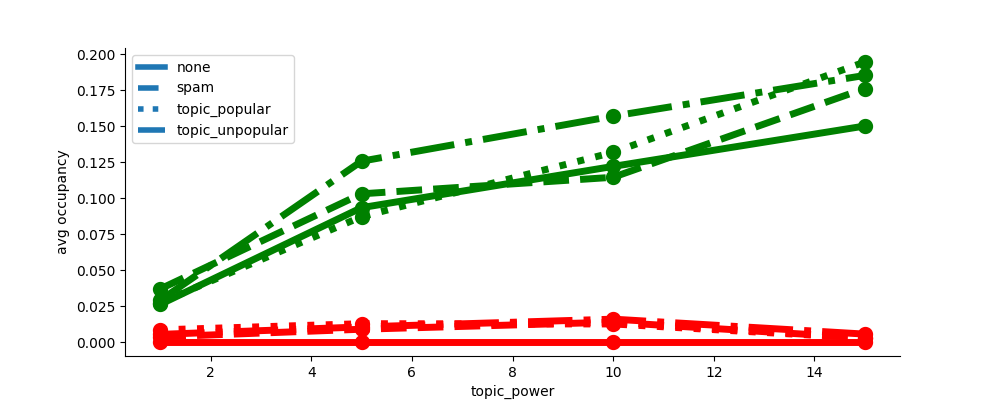

# Waiting time parameter selection

The waiting time formula:
* **n** - capacity of the table
* **d** - number of entries currently in the table
* **d(IP)** - number of entries currently in the table with given IP
* **d(ID)** - number of entries currently in the table with given ID
* **d(topic)** - number of entries currently in the table with given topic
* **a** - registration lifetime (time spent in the table)
* **w** - waiting time

In this report, we investigate the new variant that enforces lower bound  for the waiting time, so that nodes are not incentivized to keep asking for new waiting times. The equivalent evaluation for the old variant can be found [here](https://github.com/datahop/p2p-service-discovery/blob/master/doc/report_m4/reports/waiting_time.md). The vulnerability of the previous variant is showed below. We create 2 populations with the same IDs/IPs/topics distribution. The honest nodes will respect the waiting times, while the "impatient" population will keep asking for a better waiting time every 500ms. Below are the result for the old variant:

<figcaption align = "center"><b>Fig.0.1 - Impatient nodes without the lower bound</b></figcaption>

The impatient ones (in red) has a clear advantage over regular nodes. The same simulation is repeated for the new variant (with the lower bound):
<figcaption align = "center"><b>Fig.0.2 - Impatient nodes with the lower bound</b></figcaption>

We do not observe any advatage for the impatient population. We proceed this evaluation with the lower bound version. 

We thus have 5 parameters to fix:
* **ip_power**
* **id_power**
* **topic_power**
* **occupancy_power**
* **base_multiplier**

We perform all the simulations with 50 honest nodes, 250 malicious honest having 10 IPs/IDs (20% of honest ones). We present results for three different table sizes: 50 (< #registrants), 300 (~= #registrants), 15000 (>> #registrants). 

## base_multiplier
We start by investigatnig base_multiplier. Lower values means lower waiting times. However, the the value must be high enough to efficiently prevent the malicious traffic from dominating the table. 

<figcaption align = "center"><b>Fig.1.1 - Base Multiplier small</b></figcaption>

<figcaption align = "center"><b>Fig.1.2 - Base Multiplier medium</b></figcaption>

<figcaption align = "center"><b>Fig.1.3 - Base Multiplier large</b></figcaption>

When the table capacity is smaller than the number of requests, all the base_multiplier values are able to keep malicious requests out the table. However, with increasing capacity, small base_multiplier values (<20) let multiple malicious requests in. This is because the occupancy part of the table remain too small and yields small witing times regardless of the topic/IP/ID modifiers. We set base_multiplier to 50 as it already prevents malicious requests from getting in, while producing small waiting times for honest registrants. 

## occupancy_power
We then investigate the occupancy_power. The value must be large enough to protect the table from overflowing. However, too big values reduces the utilization of the table. 

<figcaption align = "center"><b>Fig.2.1 - Occupancy Power small</b></figcaption>

<figcaption align = "center"><b>Fig.2.2 - Occupancy Power medium</b></figcaption>

<figcaption align = "center"><b>Fig.2.3 - Occupancy Power large</b></figcaption>

The parameter does not have almost any impact when the number of honest registrants is smaller than the capacity of the table, but plays a big role when the capacity and the number of registratns are similar. Our experiments shows that values lower than 4 may cause table overflowing. We thus fix the occupancy power to 5 that prevents from overflowing while ensuring high table utilization even for low capacities. 

## id_ip_power
ID/IP power determines how aggresively the algorithm tries to prevent the same IP addresses/IDs to get in the table at the same time. Lower values better protects against Sybil attacks. At the same time, they can make it difficult for honest registrants comming from the same IP address (e.g., using NAT) to register at the same registrar. 
<figcaption align = "center"><b>Fig.3.1 - ID/IP Power small</b></figcaption>

<figcaption align = "center"><b>Fig.3.2 - ID/IP Power medium</b></figcaption>

<figcaption align = "center"><b>Fig.3.3 - ID/IP Power karge</b></figcaption>

The parameter has the highest impact when the number of registrants is much lower than the capacity of the table. We conclude the id-ip_power set to 0.2 reliably protects the table from malicious attacker. At the same time, such a value allow a small number of honest registrations coming from the same IP address, to get in the table simultanousely. 

## topic_power
Finally, we investigate the topic_power. It's similar to the id_ip_power. However, we expect a zipf distribution of topic popularity in the system and thus investigate much larger values for this parameters (that will discriminate less against registrations for the same topic). Higher values make help honest registrations to get in, but pose a higher risk to starve less popular topics. 
<figcaption align = "center"><b>Fig.4.1 - Topic Power small</b></figcaption>

<figcaption align = "center"><b>Fig.4.2 - Topic Power medium</b></figcaption>

<figcaption align = "center"><b>Fig.4.3 - Topic Power large</b></figcaption>

We fix this parameter to 10. Further increase does not yield additional benefits (e.g., more honest registrants in the table), while 10 still allows to reduce the waiting time (and thus presence in the table) of less popular topics. 

## Conclusion
Out simulations determined the following parameter values:
We thus have 5 parameters to fix:
* **ip_power** - 0.3
* **id_power** - 0.3
* **topic_power** - 10
* **occupancy_power** - 5
* **base_multiplier** - 50
