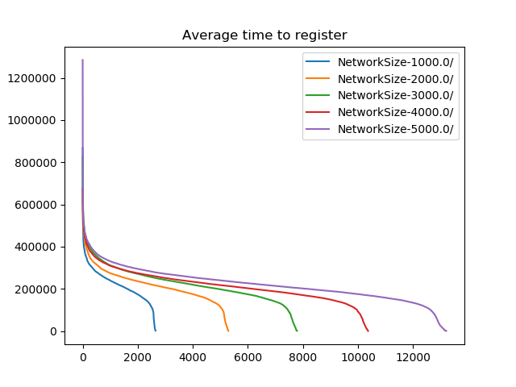
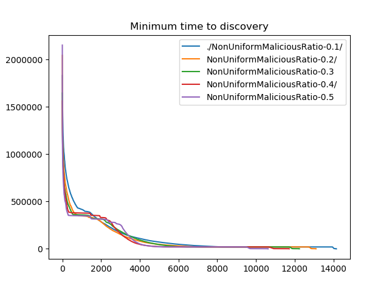
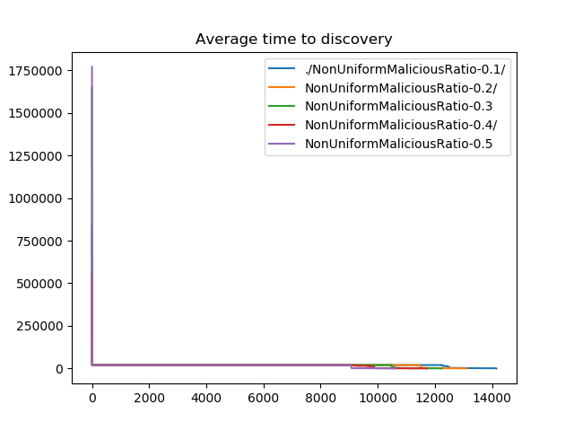
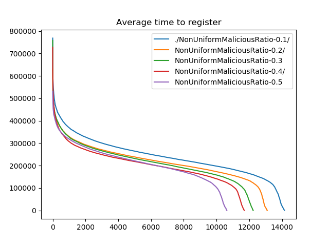
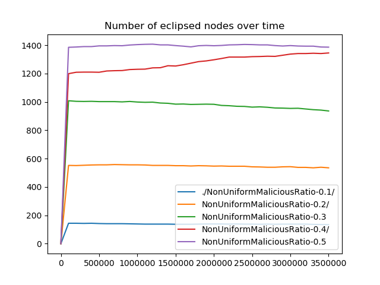
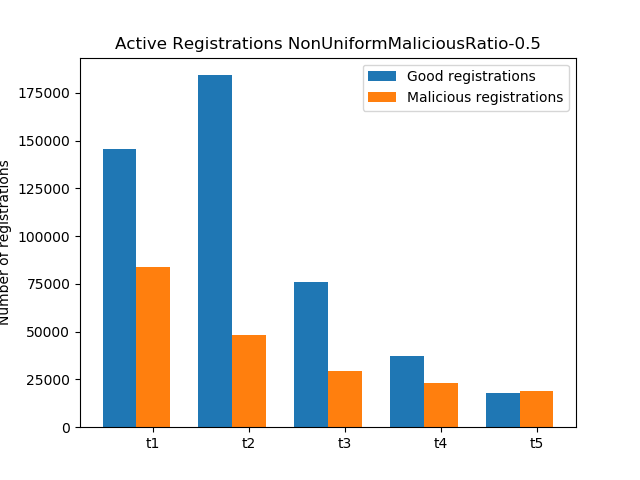

# Report with attacks

## Setup

The default parameters used in the simulation are the following:
* Total simulation time: 1 hour
* Turbulence: rate of turbulence is a function of network size. Every (Network size / Simulation time) seconds, a node addition or removal is triggered based on the following probabilities: probability(adding a node) = 0.25 probability(removing a non-malicious node) = 0.25 probability(doing nothing) = 0.5 and probability(removing malicious node) = 0.
* Ratio of malicious to all nodes is 0.2.
* Network size is 5K nodes unless otherwise stated.
* Bucket size: 17 (for routing, ticket and search table).
* Topic table: 100 per topic limit and 500 total limit.
* Registration expiration time: 50seconds.
* Nodes are assigned to a minimum of 2 and maximum of 5 topicsbased on a Zipf distribution (exponent 1.0).
* By default, malicious nodes select IDs that are close to the topic ID they attack. The distribution of malicious nodes across topics follows the popularity distribution of topics; that is, the most popular topics are attacked by the majority of malicious nodes.
* Topic Lookups: follow the RANDOM_BUCKET_ORDER. Each node makes ALPHA=3 parallel lookups, each selecting a random distance within which nodes are queried as a starting point. Then, each parallel lookup gradually moves the search towards nodes closer to the topic hash.

The default behavior of attackers are as follows:
* Malicious nodes attacking the same topic are aware of each other's existence, i.e., they collude.
* Return only malicious nodes in response to Kademlia Find messages and when they return their neighbors for ticket requests and topic lookups.
* Spam other nodes for the topic they are attacking.
* Return only other malicious nodes in result of topic queries.

## Network Size Experiments
The network size experiments provide a performance comparison between topologies of sizes 1K, 2K, 3K, 4K, and 5K.
* `./config/RangeExperiments/networkSize.cfg

  

Average discovery times.

  

Average registration times.

  

Eclipsed nodes over time.

  

Registration origin.

## Percentage of Malicious Nodes Experiments

In this section, we perform experiments for varying ratios of malicious nodes: 0.1, 0.2, 0.3, 0.4, and 0.5. 

  

Average discovery times.

  

Minimum discovery times.

  

Average registration times.

  

Minimum registration times. 

  

Eclipsed nodes over time.

  

Discovered malicious nodes in lookups.

  

